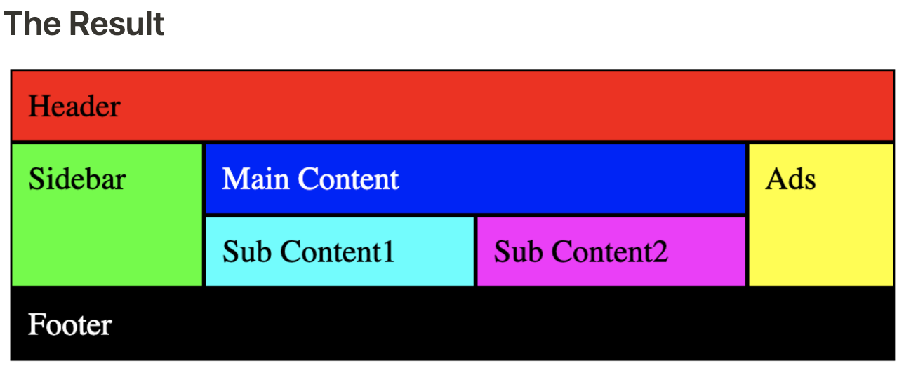

# CSS Responsive Layout Practice

## Resources

[HTML For Beginners Youtube Playlist](https://www.youtube.com/playlist?list=PL0Zuz27SZ-6OlAwitnFUubtE93DO-l0vu)  

[All HTML5 Tags](https://www.w3schools.com/tags/tag_html.asp)

## MISC

[README Git Notes](https://github.com/binaryballer33/css_grid/blob/main/README.md#git-notes)  

[README CSS Grid HTML Demo Notes](https://github.com/binaryballer33/css_grid/blob/main/README.md#demo-layout-with-html--css-code)  

[README CSS Grid Notes](https://github.com/binaryballer33/css_grid/blob/main/README.md#css-grid)  

[README FlexBox Notes](https://github.com/binaryballer33/css_grid/blob/main/README.md#flexbox)

[Windows Subsystem For Linux ( WSL )](https://www.youtube.com/watch?v=HluqqlSotGg)

### CSS

[CSS For Beginners Youtube Playlist](https://www.youtube.com/playlist?list=PL0Zuz27SZ-6Mx9fd9elt80G1bPcySmWit)  

[All CSS3 Selectors](https://www.w3schools.com/css/css_selectors.asp)  

[CSS Positioning Explained ( absolute, relative, etc )](https://www.youtube.com/watch?v=MxEtxo_AaZ4)  

[CSS Grid Playlist](https://www.youtube.com/playlist?list=PLu8EoSxDXHP5CIFvt9-ze3IngcdAc2xKG)

### CSS Grid & FlexBox

[CSS Grid Simple Layout Demo Code](https://github.com/binaryballer33/css_grid?tab=readme-ov-file#demo-layout-with-html--css-code)  

[CSS Grid ( Design Your Website Layout ) Short Video](https://www.youtube.com/watch?v=68O6eOGAGqA)

[Flexbox Quick Video](https://www.youtube.com/watch?v=phWxA89Dy94)  

[Flexbox ( Used For CSS Positioning and Layout ) Playlist](https://www.youtube.com/watch?v=Y8zMYaD1bz0&list=PL4cUxeGkcC9i3FXJSUfmsNOx8E7u6UuhG)

### CSS Frameworks

[Bootstrap Playlist](https://www.youtube.com/playlist?list=PL4cUxeGkcC9joIM91nLzd_qaH_AimmdAR)

### Javascript

[Javascript Playlist ( All Topics Covered )](https://www.youtube.com/playlist?list=PL0Zuz27SZ-6Oi6xNtL_fwCrwpuqylMsgT)

### React

[React Playlist](https://www.youtube.com/playlist?list=PL0Zuz27SZ-6PrE9srvEn8nbhOOyxnWXfp)

### Git

[Git Version Control System ( VCS )](https://www.youtube.com/watch?v=8JJ101D3knE)
[Git Notes](https://github.com/binaryballer33/css_grid?tab=readme-ov-file#git-notes)

### Linux

[Linux Playlist](https://www.youtube.com/playlist?list=PLS1QulWo1RIb9WVQGJ_vh-RQusbZgO_As)
[Linux ls, pwd and cd](https://www.youtube.com/watch?v=MmHcOPJEjGA)
[Linux rm, cp and mv](https://www.youtube.com/watch?v=QpV2qnakpOo)

## Demo Layout With HTML & CSS Code

### grid container/layout

```css
.grid-layout {
  display: 'grid';
  grid-template-areas: 
  'header header header header'
  'sidebar mainContent mainContent ads'
  'sidebar mainContent mainContent ads'
  'sidebar subContent1 subContent2 ads'
  'footer footer footer footer';
}

/* The Grid Selectors and Values are the only important parts for this */
/* The rest is just for styling purposes to make things stand out */

.header { 
    grid-area: header /* don't need to put the value in " " */
}

.divStyles {
  border: 1px solid black;
  padding: 8px;
  text-align: center;
}

.grid-layout {
    display: grid;
    grid-template-areas: 
    'header header header header' /* 4 columns for the header */
    'sidebar mainContent mainContent ads' /* 1 column wide sidebar, 2 column wide main content, 1 column wide ads */
    'sidebar mainContent mainContent ads' /*  same as above */
    'sidebar subContent1 subContent2 ads' /* 1 column sidebar, 1 column sub content 1, 1 column sub content 2, 1 column ads */
    'footer footer footer footer'; /* 4 columns for the footer */
}

.header { 
    grid-area: header; /* don't need to put the value in " " */
    background-color: #FF0000;
}

.sidebar { 
    grid-area: sidebar;
    background-color: #00FF00;
}

.mainContent { 
    grid-area: mainContent;
    background-color: #0000FF;
    color: white;
}

.ads { 
    grid-area: ads;
    background-color: #FFFF00;
}

.subContent1 { 
    grid-area: subContent1;
    background-color: #00FFFF;
}

.subContent2 { 
    grid-area: subContent2;
    background-color: #FF00FF;
}

.footer { 
    grid-area: footer;
    background-color: #000000;
    color: white;
}
```

```html
<!DOCTYPE html>
<html lang="en">
<head>
    <meta charset="UTF-8">
    <meta name="viewport" content="width=device-width, initial-scale=1.0">
    <title>CSS Grid Testing</title>
    <Link rel="stylesheet" href="style.css">
</head>
<body>
    <div class="grid-layout">
        <div class="divStyles header">Header</div>
        <div class="divStyles sidebar">Sidebar</div>
        <div class="divStyles mainContent">Main Content</div>
        <div class="divStyles ads">Ads</div>
        <div class="divStyles subContent1">Sub Content1</div>
        <div class="divStyles subContent2">Sub Content2</div>
        <div class="divStyles footer">Footer</div>
    </div>
    
</body>
</html>
```

### The Result



## CSS Grid

[CSS Grid Video](https://www.youtube.com/watch?v=68O6eOGAGqA&t=2s)

- Grid has a steeper learning curve than FlexBox
  - Grid has more CSS Selectors to learn
- Grid is more customizable than FlexBox
  - Can build layouts pretty simply and exactly the way you want
    - Can have rows and columns structured exactly the way you want
- CSS Grid Selectors
  - `grid` - sets the display to grid ***( display: grid )***
        - gets rid of all of the margin and padding the child elements had
  - `gap` - gets you margin and padding between other grid child elements ***( gap: 16px )***
        - gap can be in px, rem, percentages ( 1.5rem, 250px, 25% )
  - `grid-template-column`
  - allows you to define your elements per row
    - ***( grid-template-column: repeat(4 , fr )*** ) will give 4 columns per row
    - the height of each column by default will be equal to the tallest column
    - columns can be in px, rem, percentages ( 1.5rem, 250px, 25% )
  - `grid-column` - shorthand for grid-column-start and grid-column-end
    - making a column that spans up 2 column spaces
    - ***( grid-column: span 2 )***
  - `grid-column-start` - define where you want the column to start
    - ***( grid-column-start: 1 )***
  - `grid-column-end` - define where you want the column to end
    - ***( grid-column-end: 3 )*** the column will span 2, the 3 is not inclusive
    - could do ***( grid-column-start: 1 )*** ***( grid-column-end: 3 ) with*** ***( grid-column: 1 / 3 )***
  - `grid-auto-columns` - any auto generated column will be the exact same height
    - ***(grid-auto-columns: 1fr)***
  - `grid-template-row` - defines how many rows you want on your layout
  - `grid-row` - shorthand for grid-row-start
    - making a row that spans up 2 row spaces
    - ***( grid-row: span 2 )***
  - `grid-row-start` - define where you want the row to start
    - ***( grid-row-start: 1 )***
- `grid-row-end` - define where you want the row to end
  - ***( grid-row-end: 3 )*** the row will span 2 rows, the 3 is not inclusive
  - you can replace ***( grid-row-start: 1 )*** ***( grid-row-end: 3 ) with*** ***(grid-row: 1 / 3 )***
- `grid-auto-rows` - any auto generated row will be the exact same height
  - ***(grid-auto-rows: 1fr)***

- `grid-template-areas` - defines in a readable format the page layout ( rows & columns )

## FlexBox

[FlexBox Video](https://www.youtube.com/watch?v=phWxA89Dy94)

[Play Around With Flex Simulator](https://codepen.io/enxaneta/full/adLPwv/)

- display: flex
- `justify-content, justify-items, justify-self & align-content, align-items, align-self` all use these values below
  - flex-start
  - flex-end
  - space-around
  - space-evenly
  - space-between
- flex-direction
  - values are ( `row & column`)

To `center` something you will mostly be using `justify-content: center` for the x-axis and `align-items: center` for the y-axis UNLESS you change the flex-direction to column, then these two selectors do the OPPOSITE of what I just wrote

## Positioning

[Positioning Video](https://www.youtube.com/watch?v=jx5jmI0UlXU)

- relative ( the default )
- absolute ( take's element off the dom, but relative to the parents position )
- static
- sticky
- fixed

## CSS Units

[CSS Units Video](https://www.youtube.com/watch?v=N5wpD9Ov_To)

- 1rem or em = 16px
  - .5 em/rem = 8px
  - 1 em/rem = 16px
  - 1.5 em/rem = 24px

- 16px aka 1 em/rem is usually the default font-size in most browsers

- Usually better to use percentages for widths in a lot of scenarios instead of pixels(px)
- if you use pixels try to only use it for max-values css selectors like max-width or max-height

## Aspect Ratios

[Aspect Ratios](https://www.youtube.com/watch?v=tStiWGcnkWI)

- Best to use aspect ratios like 16/9 "landscape" or 4/3 "potrait" when declaring image sizes
- in order to use aspect ratios you will have to first give the image a width or height
- better to get the image a width using a percentage then declare the aspect ratio for portrait or landscape mode

## Media Queries

 [Media Queries](https://www.youtube.com/watch?v=K24lUqcT0Ms)

- @media by default include ( @media screen @media print, etc )
- if you are doing mobile first development then you will be using a lot of @media screen and (min-width: 900px)
- if you are doing desktop first development then you will be using a lot of @media screen and (max-width: 900px)

## Git Notes

### Creating A Brand New Git Repo From Scratch On Your LOCAL Computer

```bash
git init

touch README.md

echo "# Hello World" >> README.md

git add README.md

git commit -m "first commit"

git remote add origin git@github.com:typeYourGitHubUserNameHere/typeYourRepositoryName.git

git push -u origin main

# YOU ALREADY HAVE THE REPO INSIDE OF GITHUB AND YOU WANT TO PUSH YOUR LOCAL CODE

# create the repo on github first
git remote add origin git@github.com:typeYourGitHubUserNameHere/typeYourRepositoryName.git

git add thefilesYouWantToAdd

git commit -m "commit message"

git push -u origin main
```

### Git configurations

```bash
# shows your git config settings
git config —global —list

#lets you edit the file in vim ( only use if you know how to use VIM )
git config —global —edit

#set your user name in git
git config —global user.name youGitHubUserName

#set your email in git
git config —global user.email yourGitHubEmail
```

### Creating a Git Directory/Project

```bash
git init # run this command inside of the directory that you want to be your project directory 
```

### Staging & Unstaging ( aka adding files and removing files to/from your next commit )

```bash
# adds the file to the staging "tracked" area
git add directoryOrFileName

# commits the file to the local git commit history
git commit -m "type your commit message here, don't make it to long"

# unstages the files
git restore —staged directoryOrFileName
```

### Fixing A Commit Message ( a commit is a collection of files that you have added/modified/deleted )

```bash
git commit —amend # (fixes a bad commit message )

or

git commit —amend -m "new commit message" # (fixes a bad commit message )
```

### Using Git Branch

```bash
# switching and creating branches

git checkout -b branchNameToCreate  # ( creates the specified branch )

git checkout branchNameToSwitchTo # branch name you want to swtich to, notice you don't need the -b flag, that's only for creating branches

git branch -d branchNameToDelete # ( deletes the specified branch )

git branch origin —delete branchNameToDeletOnRemoteRepo # ( deletes the specified branch on the remote )
```

### Using Git Diff

```bash
git diff # ( shows the diff for the files you made changes to BEFORE you stage(add) them )

git diff commitId1 commitId2 # ( shows you the diff between those 2 commits )

git diff HEAD~1 # shows the diff between the current commit and the commit before it
```


### Using Git Log

```bash
git reflog # ( shows commits in the order in which you last referenced them )

git reflog # ( shows all the git commits, git merge, git checkouts, etc you've done )

git log # ( shows only the git commits along with their author, date, commit message and full hash )

git log —stat # ( shows us files that were changed in the commit, along with their insertions and deletes count )
```

## INTERMEDIATE LEVEL GIT COMMANDS

### Using Git Stash

```bash
# note, stashes DO carry over from branch to branch
git stash save "message about the changes you are stashing"
# All the changes you made are now stashed, the git status and git diff shows no updates

git stash list # ( shows all of your stashes )

git stash apply stash@{0} # will apply this specific stash ( bringing back changes stashed in that stash )

git stash pop # ( applies the top stash aka the stash@{0}, then deletes the stash )

git stash drop stash@{X} # ( deletes that stash that you specify )
```

### Using Git Fetch, Git Pull, Git Merge

```bash
git fetch # ( downloads all the changes from the remote, ex new branches, commits, etc. Doesn't change your work )

git fetch —all

git merge # ( merges code together, if 2 people changed the same thing you will have merge conflicts )

git pull # ( runs git fetch first, then git merge )

git pull —verbose # ( shows more information about what is being pulled )
```

### Moving A Commit From 1 Branch To Another Branch

```bash
# Go to the branch with the wrong commit and do a “git log“, get the commit id you want for the other branch
git checkout branchNameToSwitchTo

git cherry-pick commitId # the commit id from the other branch>

# cherry-pick doesn't delete the commit on the old branch, so you have to do it go back to the branch with the incorrect commit
- git reset —soft commitId # commit you want to go back to ( git reset —soft will keep all of your work AND keep it staged )

- git reset commitId  # you want to go back to ( git reset —mixed will keep all of your work AND remove it from stage)

- git reset —hard commitId # commit you want to go back to ( git reset —hard will delete all of your changes that are tracked)

- git reset —hard HEAD~1 # ( HEAD~1 means the commit before HEAD )
```

### How To Recover Commits  After You Accidentally Delete Them By Using Git Reset

```bash
git reflog ( get the commit id that contained those changes )
git checkout commitId
git log ( will show you have that commit back )

# YOU ARE CURRENTLY ON A DETACHED HEAD, NOT ON A BRANCH ( THIS WILL BE DELETED IF NOT SAVED )
git branch branchName
or 
git checkout -b branchName

# ***HOW TO UNDO A COMMIT AFTER EVERYONE ELSE HAS ALREADY PULLED THOSE CHANGES***
git revert commitId # ( this creates a new commit on top of the old ones, undoing the changes of that commit id )